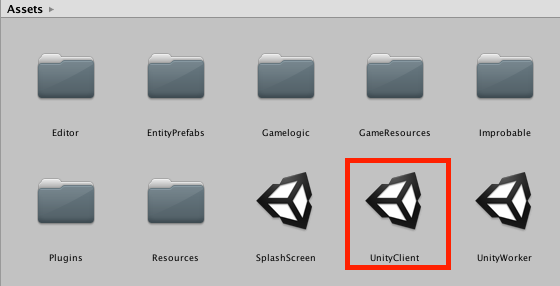
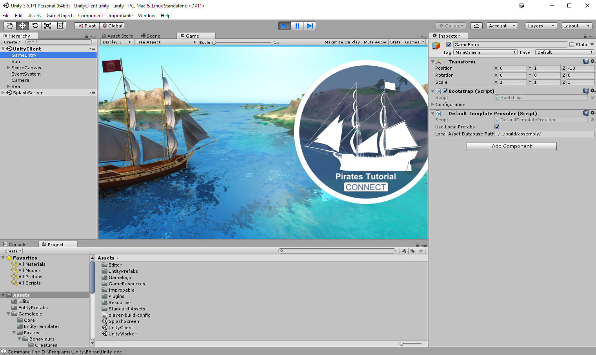
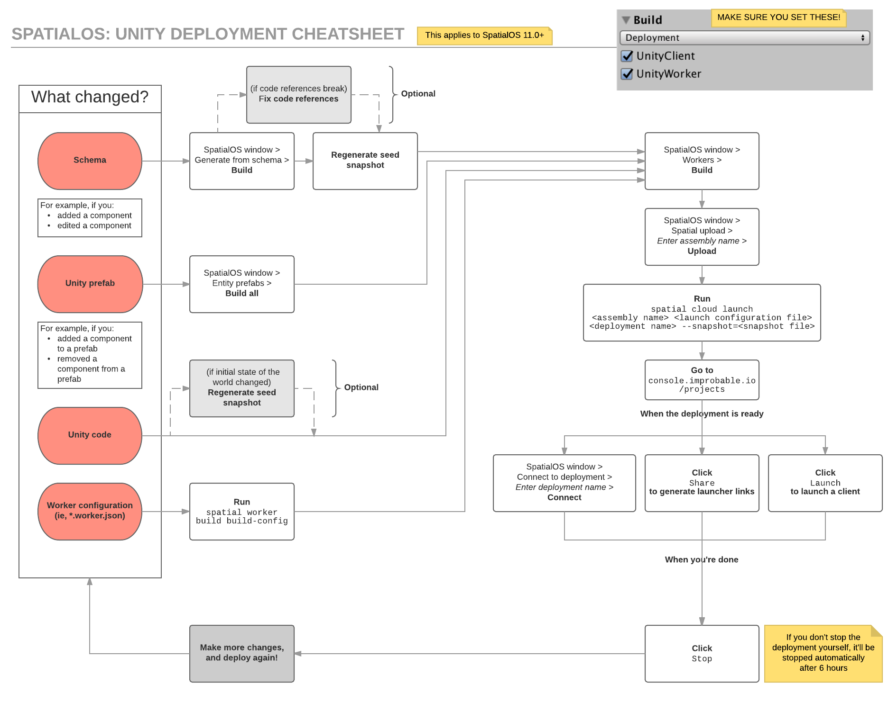

# Deploying

This page is about deploying from the Unity Editor. If you want to build from the command line, see
[Deploying locally from the command line (SpatialOS documentation)](https://docs.improbable.io/reference/12.2/shared/deploy/deploy-local).

## Run a local deployment

1. In the Unity Editor, open the SpatialOS window (`Window > SpatialOS`).
2. Under `Run SpatialOS locally`, click `Run`.

    This opens a console running `spatial local launch`.

When SpatialOS starts successfully, you should see `SpatialOS ready` in the console. At this point, you can access the
[Inspector (SpatialOS documentation)](https://docs.improbable.io/reference/12.2/shared/glossary#inspector) at [http://localhost:21000/inspector](http://localhost:21000/inspector).

## Connect a client

Once the deployment is running, to connect a Unity client:

1. In Unity, open `workers/unity` (or the directory that contain the Unity client),
   and open the scene `UnityClient.unity`. 

    

2. At the top, click **Play ▶**.

    The scene will open, looking something like this:

    

## Deploying to the cloud

For information about deploying to the cloud, see [Deploying to the cloud (SpatialOS documentation)](https://docs.improbable.io/reference/12.2/shared/deploy/deploy-cloud).

### Unity cheat sheet

For a handy guide to how to deploy Unity projects to the cloud, see
[this cheat sheet](../assets/deploy/unitycloudcheatsheet.pdf):

