# A tour of SpatialOS

Welcome to SpatialOS! This hands-on tour will take you through the unique benefits
 of developing with SpatialOS.

You'll learn what the platform does, see how a game feature is implemented, and
 discover the tools and infrastructure that come with SpatialOS.

This video below demonstrates the power of SpatialOS. You will see stages of the
development workflow through the eyes of a SpatialOS developer. If you have a
SpatialOS account](https://spatialos.improbable.io/get-spatialos), you can
follow along with the steps yourself in the video.

Click on the image to see the youtube video.
[](https://youtu.be/bGYCaWl-t5c)

## What is SpatialOS?

SpatialOS is a cloud compute platform that you can use to develop bigger, better
multiplayer games, faster, and with smaller teams. You can make games of any genre
and size, with game worlds of tens of thousands of square miles, shared by thousands
of players.

You develop your game on your machine using a game engine like Unity or Unreal.
When you're ready to launch the game, you deploy it to the cloud. SpatialOS runs
many instances of the game engine in headless mode (we call these [workers (SpatialOS documentation)](https://docs.improbable.io/reference/13.0/shared/glossary#worker)),
stitching them together so they form a single game world. All SpatialOS games
are multiplayer by default, and you don't have to write a single line of networking code.

## The Wizards demo

Wizards is a demo game built using SpatialOS and Unity but it could be easily
replicated in Unreal. The game world is a forest, inhabited by two teams of wizards
and lumberjacks. Lumberjacks chop down trees and collect the wood; wizards cast spells
 (rain and lightning). When trees are chopped down or set on fire, they grow back over time.

It looks like this:

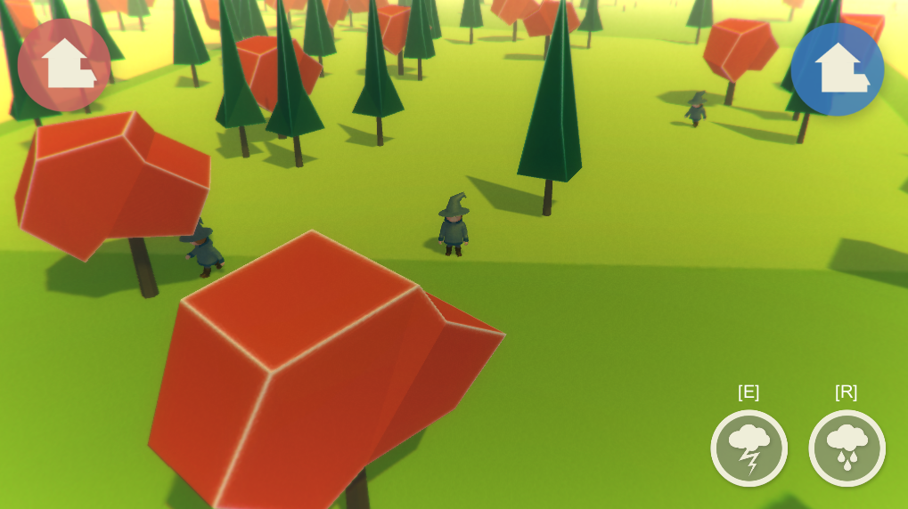


This demo looks fairly simple, but it's actually a massively multiplayer online game
with distributed high-fidelity physics and game logic, and thousands of AI-driven NPCs.
An unlimited number of players can connect to its continuous game world with an area
of a square kilometre. That's tiny by SpatialOS standards, but it's enough to show what
the platform can do.

## Hands-on tour

During the hands-on tour of the Wizards demo, you'll:

* set up SpatialOS
* run the game in the cloud
* play and explore the game
* take a closer look at a game feature and the code behind it
* try the tools and infrastructure

## Set up SpatialOS

In this step, you'll install the `spatial` command-line tool, which you need in order to
build and run the Wizards demo game.

### 1. Sign up for SpatialOS

If you haven't already, [sign up for SpatialOS](https://spatialos.improbable.io/get-spatialos).

### 2. Set up your machine

To set up your machine for developing with SpatialOS, follow the setup guide for your OS:

* [Windows](../get-started/setup/win.md)
* [Mac](../get-started/setup/mac.md)

### 3. Check and complete the installation

In a terminal window, run `spatial update`. You should see the following output:

```none
Current version of the 'spatial' command-line tool: <version number>
Attempting to download the latest version...
Did not update 'spatial'. Latest version is already installed.
```

## Run the game in the cloud

In this step, you’ll download the source code of Wizards, and use the command-line tool
to **deploy** it - that is, run it in the cloud - so that players anywhere in the world can join.

Once you're ready to try out a SpatialOS game, you can run it in a cloud deployment. This means
that SpatialOS will start workers (ie instances of game engines in headless mode) in the cloud
to run the server-side game logic, and you can connect clients to play the game.

Before you run a cloud deployment, you need to build all the files the game uses and upload them
(using the command `spatial upload`) to the SpatialOS servers. This includes executable files
for the clients and workers, the assets, and so on. We call that set of game files an _assembly_.

### 1. Download project source code

Download and unpack [the Wizards zip file from GitHub](https://github.com/spatialos/Wizards/archive/master.zip) which contains the complete source code, assets,
and configuration files for the Wizards demo.

### 2. Initialize the project

The first time you run a game in the cloud, you need to add some information to your project configuration:

1. Open the project configuration file: `spatialos.json`, in the project root directory.
2. Change the `name` value (currently `your_project_name_here`) to your SpatialOS project name.

    You can find yours in the [SpatialOS console](https://console.improbable.io). It'll be something like
    `beta_someword_anotherword_000`.

### 3. Build an assembly for the deployment

To build the assembly your game will use when running in the cloud, use the command
`spatial worker build --target=deployment`:

1. Make sure the Unity Editor is closed.

    If you don't close Unity before running `spatial worker build`, the command will report an error.
2. In the root directory of the project, run `spatial worker build UnityWorker UnityClient --target=deployment`.

    You know it's worked when you see `'spatial.exe build UnityWorker UnityClient' succeeded` (or
    `'spatial build UnityWorker UnityClient' succeeded` on Mac) printed in your console output.

### 4. Upload assembly to the cloud

The command `spatial cloud upload <assembly name>` uploads the assembly to the cloud. The `<assembly name>` is just a label
so you can identify this assembly in the next step — for example, `my_wizards_assembly`.

To upload the assembly, run:

```
spatial cloud upload my_wizards_assembly
```

You know it's worked when you see `'spatial.exe upload my_wizards_assembly' succeeded (<time to finish>)`
(or `'spatial upload my_wizards_assembly' succeeded (<time to finish>)` on Mac) printed in
your console output.

### 5. Deploy to the cloud

To start the deployment, run this command:

```none
spatial cloud launch my_wizards_assembly default_launch.json wizards_demo --snapshot=snapshots/default.snapshot
```

After a couple of minutes, you should see `Successfully created deployment` printed in the terminal.

## Explore the game

### Start a game client

Players connect to your game by running a game client on their machines. They can download it directly
from the SpatialOS servers, or you can distribute it in any way you want (for example, through Steam).

For this demo, download the game client from the SpatialOS servers:

1. Install the SpatialOS game launcher (you only need to do this once):
    * For [Windows](https://console.improbable.io/launcher/download/stable/latest/win)
    * For [Mac](https://console.improbable.io/launcher/download/stable/latest/mac)
2. Open the [SpatialOS console](https://console.improbable.io/projects) in a new tab.
3. Click on the name of the deployment (`wizards_demo`).
4. Launch the game by clicking **▷ Launch**:
    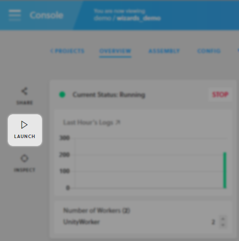

The Launcher will download the game client and run it. This may take a few seconds.

The client configuration window will open. Click **Play!** to launch with the default settings.

Once it's running, click **CONNECT** to join the game!


### Open the Inspector

The Inspector is a web-based tool that lets game developers explore the internal state of a SpatialOS world.
You'll use it through this tour to find out about the main SpatialOS concepts.

From the deployment page you had open already, click **Inspect**, which opens the Inspector in
a new tab. We suggest putting the game window and the Inspector window side by side:

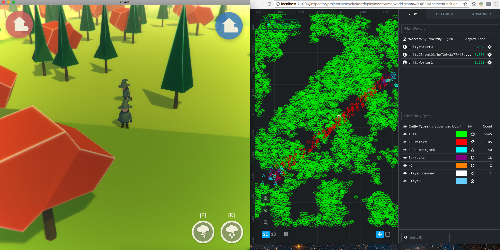

#### The Inspector window

Every _thing_ in your game world is an [entity (SpatialOS documentation)](https://docs.improbable.io/reference/13.0/shared/glossary#entity). Entities are made of
[components (SpatialOS documentation)](https://docs.improbable.io/reference/13.0/shared/glossary#component) which describe their properties (like position,
health, waypoints).

The main area of the Inspector shows you a top-down, real-time view of the entities in your game world. The trees are
shown in green, the NPCs in red, and the players in blue. (These colors are completely configurable, of course.)

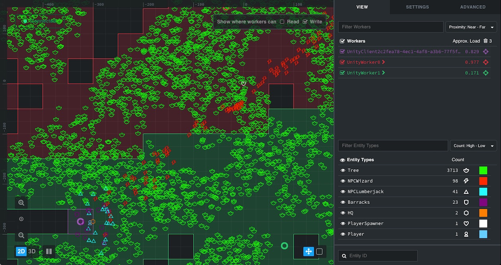

The bottom-right list initially shows how many entities of each type there are right now. We'll look
at this area in more detail later.

The top-right list shows the workers connected to SpatialOS. This includes the workers that run the server-side
game logic (in this case, `UnityWorker0` and `UnityWorker1`), and a game client for every player connected
(in this case, just one: yours!).

The number next to each worker represents its _load_: a measure of how much work it is
doing. SpatialOS uses this number to start and stop workers as necessary.


#### Optional: stop a worker

To see worker management in action, you can stop one of the workers running the game logic, and see how SpatialOS
instantly reassigns the whole world to the single remaining worker, while it starts a new one - without any disruption
to players at all. To try this:

1. Click on `UnityWorker0` in the list of workers. This shows details about that worker.
2. Click the red **Stop worker** button. This shows a confirmation dialog.
3. Click the **Stop Worker** button.

SpatialOS stops the worker immediately. Just a few seconds later, the load-balancing algorithm kicks in, and it starts
a new worker. Note that nothing at all happens in the game window - the client isn't even disconnected.
Load-balancing is completely invisible to players!

### Walk around

In the game window, you can control your character - a wizard with a pointy hat - using the WASD keys. Rotate the
camera by holding the right mouse button and moving the cursor; zoom in and out using the scroll wheel.

The Inspector shows you a live view of the game world, so you can watch your character's entity moving in the
Inspector while you move it in the game window.

1. Select your entity.

    If you can't find your entity, zoom out until the entity list on the right includes a `Player` entity:
    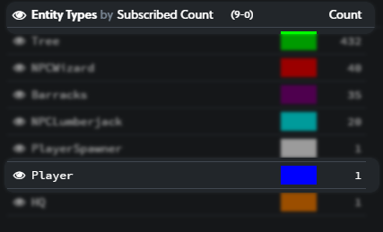

2. In the list, click on the word `Player`. Every other entity in the main area should be dimmed, making the `Player`
   entity easier to spot:

    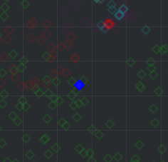

3. In the main view, click on the icon of the `Player` entity to select it. The bottom right area of the inspector shows you
the current values of its properties.

4. Find the property called `coords` in the `improbable.Position` component:

    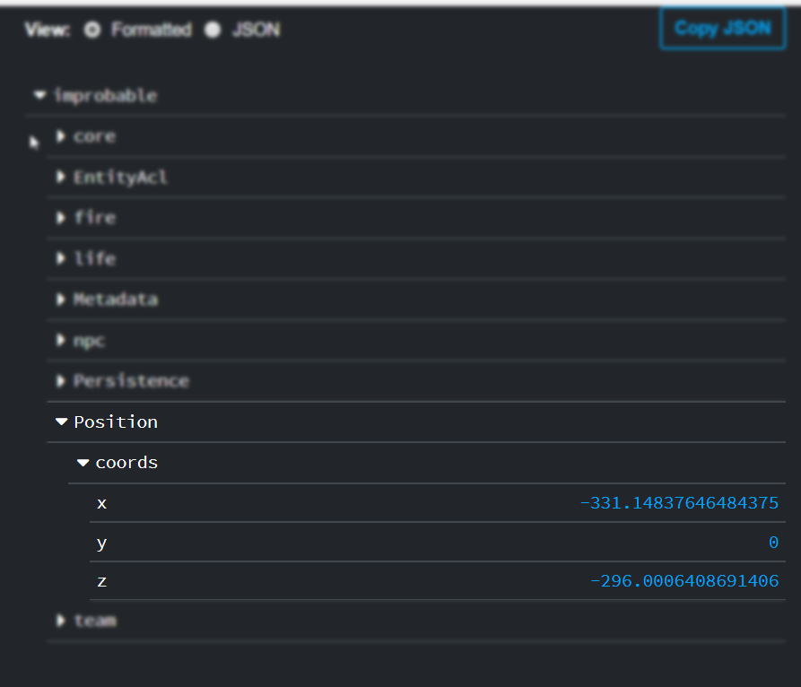

5. Go back to the game window, and use the WASD keys to move your character. You'll see the values of the position properties
changing as you move.


#### Optional: cross worker boundaries

Press back in your browser to return to the main inspector view.

The top-right area of the Inspector shows two workers of type `UnityWorker`, which run the game logic for the simulation.
Hold the CTRL/⌘ key and click on both. You'll see red and green outlines appearing in the map view:


These outlines represent the regions that contain the entities each worker is responsible for (we call these their
_authority regions_). SpatialOS assigns these regions in real time, and they change dynamically in response to what
happens in the game world, or when workers start or stop.

Look again at the components of the Player entity. You can see that one of the two workers currently has write access to most
of its components (in this case, `UnityWorker7`):

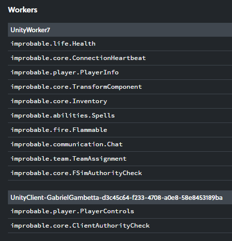

Write access means that that worker can _make changes_ to the component. Other workers might be able to _read_ from it -
but only one worker can _write_.

Note that the client has write access to two components. This is how the client can send the player's inputs to SpatialOS.

In the game window, move your character across the boundaries of the authority regions. At some point
you'll see the components move from being under one worker's authority to being under another's, but you won't see any change
in the game - even though the data for the character was handed over to the other worker, which could be running on a
different physical machine.

In SpatialOS all this happens without any effort from the game developer; it's also entirely invisible to the user.


#### Optional: invite more players

Every SpatialOS game is multiplayer by default, so you can invite other players to join. If you want to do this, follow
these steps:

1. Go to the deployment page for your game in the [SpatialOS console](https://console.improbable.io/projects).
2. Click the **Share** button.
3. Check the checkbox, and click **Get Share URL**:

    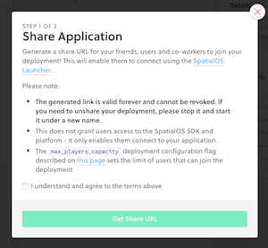

4. Share the link with anyone you want to invite.


### Start a fire

In the game window, move your character next to a group of trees that haven't been chopped down by the lumberjacks. Then,
in the Inspector window, select an entity that represents one of these trees.

The tree entity has a `Flammable` component with properties that represent whether it is on fire, the size
of the flames when it is, and so on. You can see that it is currently not on fire:


In the game window, make sure your character is close to (but not right next to) some trees. Press the E key to
go into spellcasting mode, point at the base of a tree with the mouse, and click. The wizard will cast the
lightning spell, and within a couple of seconds, the tree will catch fire.

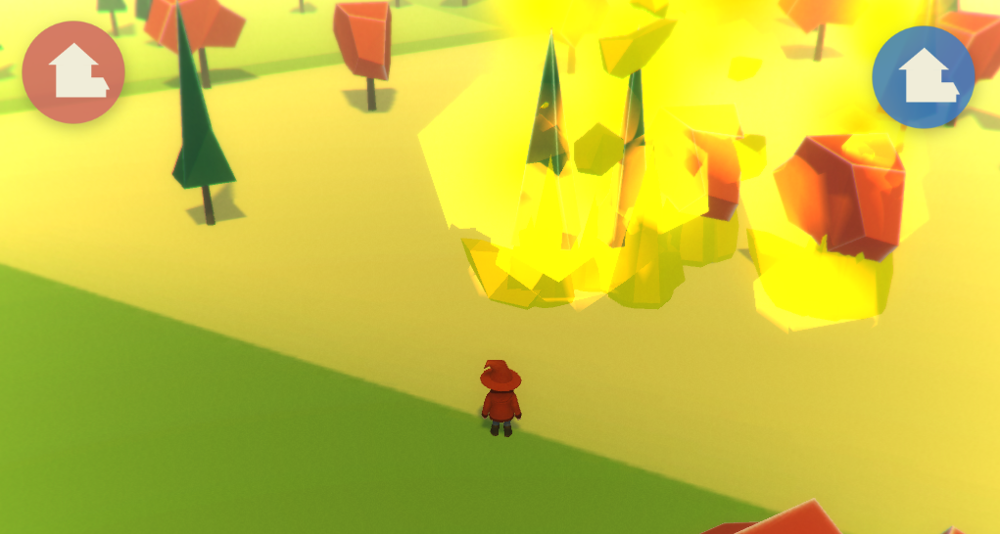

Notice how the values of the `Flammable` component in the Inspector now show that the tree is on fire.

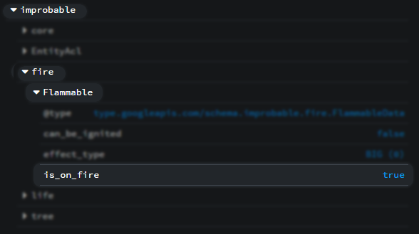

If there are other trees close to the one you set on fire, after a few seconds you'll notice something else:
fire propagates to nearby trees. And if your character is too close to one of the trees, it may catch fire too!

The trees will eventually burn down completely:

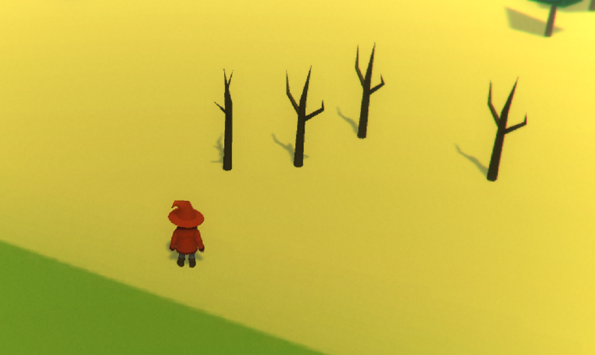

You can see their final internal state in the Inspector window:

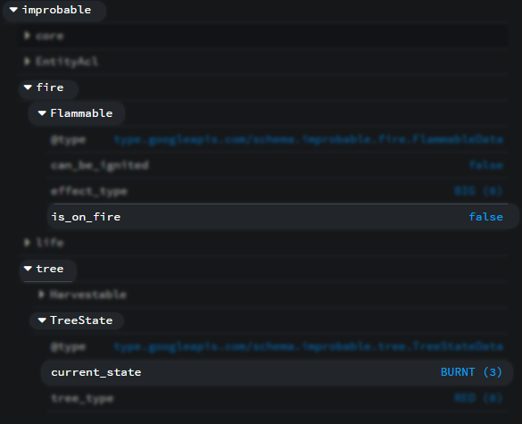


## Take a closer look at a game feature

We'll now take a closer look at the inner workings of the fire propagation feature you just tried.

Depending on how close the trees are, setting any single one on fire could set the entire game world on fire.
This involves game logic, and the propagation of state between entities controlled by different workers.

So this feature needs both a data model to represent flammable entities, and game logic to make fire spread from
one entity to another.

### Data model

The data model for your entities is defined in the project's [schema (SpatialOS documentation)](https://docs.improbable.io/reference/13.0/shared/glossary#schema).
It describes the [components (SpatialOS documentation)](https://docs.improbable.io/reference/13.0/shared/glossary#component) that make up the entities, the names and [data types (SpatialOS documentation)](https://docs.improbable.io/reference/13.0/shared/schema/reference#types)
of the properties of each component, and the [commands (SpatialOS documentation)](https://docs.improbable.io/reference/13.0/shared/glossary#command) that can be performed on them.

Here's the relevant part of the schema for the `Flammable` component, which all flammable entities will have:

```schemalang
enum FireEffectType {
  BIG = 0;
  SMALL = 1;
}

component Flammable {
  id = 1400;

  bool is_on_fire = 1;
  bool can_be_ignited = 2;
  FireEffectType effect_type = 3;

  command Nothing ignite(Nothing);
}
```

The `Flammable` component has three properties that define how flammable entities are represented in this demo
(`is_on_fire`, `can_be_ignited`, and `effect_type`) and a command that defines an action that can be performed
on flammable entities (`ignite`).


### Game logic

The schema described above defines a data model for flammable entities, but it says nothing about how these entities
should behave. This game logic can be implemented using your game engine (Unity or Unreal).
The Wizards demo uses Unity.

Here's the code that runs when the `Flammable` component receives an `ignite` command:

```csharp
private void Ignite()
{
    if (!flammable.Data.isOnFire && flammable.Data.canBeIgnited)
    {
        SendIgniteUpdate();
        spreadFireCoroutine = StartCoroutine(TimerUtils.WaitAndPerform(FireSpreadInterval, SpreadFire));
    }
}
```

This does two things - first it calls `SendIgniteUpdate`, which updates the `is_on_fire` and `can_be_ignited` properties
previously defined in the schema:

```csharp
private void SendIgniteUpdate()
{
    var update = new Flammable.Update();
    update.SetIsOnFire(true).SetCanBeIgnited(false);
    flammable.Send(update);
}
```

`Send(update)` sends this new information to SpatialOS, which automatically propagates it across the game world. This is
what allows other workers and clients to know about the state of this particular entity.

Second, it makes `SpreadFire` run periodically to spread fire to other flammable entities in its vicinity:

```csharp
private void SpreadFire()
{
    var count = Physics.OverlapSphereNonAlloc(transform.position, FireSpreadRadius, colliders);
    for (var i = 0; i < count; i++)
    {
        var other = colliders[i].transform.GetComponentInParent<FlammableDataVisualizer>();
        if (other != null && other.canBeIgnited)
        {
            other.GetComponent<FlammableBehaviour>().Ignite();
        }
    }
}
```

This piece of code looks for entities within `FireSpreadRadius`, and if they have a `Flammable` component (and are not
burnt down or already on fire), sets them on fire.

It uses a mixture of Unity code
(`Physics.OverlapSphereNonAlloc`), SpatialOS APIs (`.Send(update)`), and code generated from the schema specifically
for your project (`update.SetIsOnFire`).

There isn't any networking code, any code to deal with entities migrating across server boundaries, or any code
to exchange data between workers. But this code can run, unmodified, in a game world tens of
thousands of square miles big, simulated by hundreds of workers.


## Try the tools and infrastructure
Your SpatialOS game can run on as few or as many cloud servers as it needs - hundreds if necessary. SpatialOS does
all of the heavy lifting associated with running a distributed system of this scale; it also provides the
tools to monitor it.

You can access the logs and metrics for your deployment by clicking the relevant button at the top bar of the Inspector
window, or at the **Details** tab of your deployment's page in the SpatialOS [console](https://console.improbable.io):


### Metrics
The [metrics (SpatialOS documentation)](https://docs.improbable.io/reference/13.0/shared/concepts/tools#metrics) dashboards
show detailed information about the health and performance of your deployment, including CPU, memory and bandwidth
usage, entity and player counts, worker load, and many more, aggregated across all workers, and plotted over time:

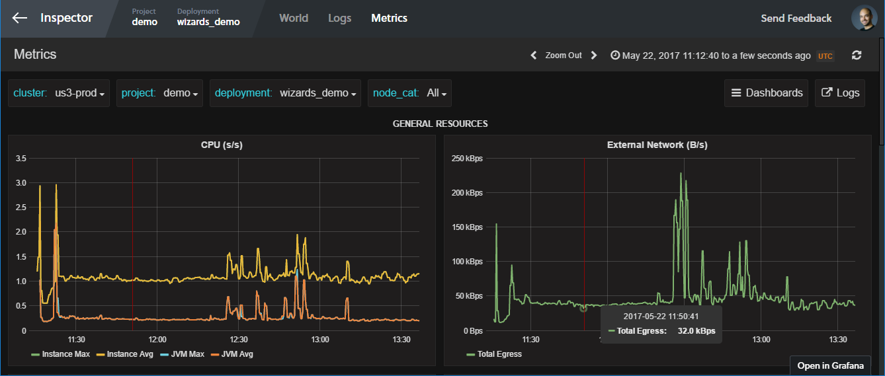

You can also define custom metrics for values that are important for your game (say, the amount of in-game currency traded),
and visualize them using the same dashboards.


### Logs
The [logs (SpatialOS documentation)](https://docs.improbable.io/reference/13.0/shared/concepts/tools#logs)
viewer shows all the information, warning and error messages generated by your game:

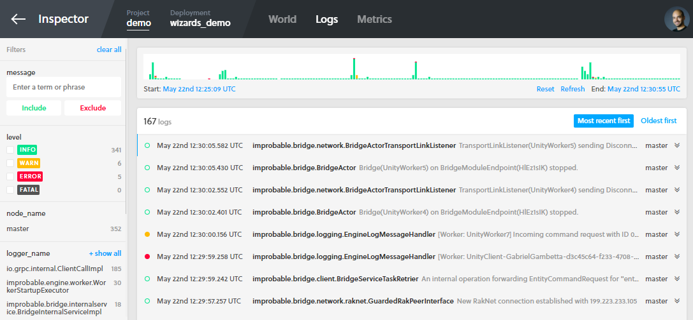

Distributed logging is an invaluable tool to diagnose and debug your deployment, and to record noteworthy events.
Like the metrics dashboard, the logs are aggregated across all workers.

## Stop the deployment
Now you've finished with the deployment, click **STOP**.

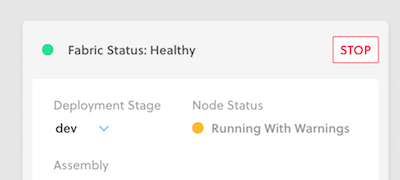

You should always stop a deployment once you've finished using or testing it.

> **Note**: By default, if you don't stop a deployment, it'll be stopped automatically 6 hours after it was started.

## Summary
This tour of the Wizards demo gave you a high-level overview of what SpatialOS can do for your game, how it works,
and the tools it gives you. Here are the key takeaways:

* You can **build multiplayer games** of any scale using SpatialOS and its game engine integrations.
* You **run the game at scale** on cloud servers managed by SpatialOS.
* You write game logic using the SpatialOS SDK and **your game engine**, such as Unity or Unreal, in headless mode. We call these "workers".
* There's **no need to write any networking code**. By default, every game is multiplayer, and can run on hundreds of servers.
* SpatialOS runs workers in the cloud - as few or as many as necessary to **support a game world as big as you want**.
* You can **inspect the internals of your game** in real time using the web-based Inspector.
* You can **monitor the health of your game** using metrics dashboards and distributed logging.

### What's next?
* To give the development workflow and APIs a go, try the [Pirates tutorial](../tutorials/pirates/overview.md).
* To find out more about the SpatialOS SDKs, explore the [technical documentation](../../README.md).
* To start developing your own game from scratch, pick an appropriate [starter project](https://github.com/spatialos/) and follow the [recipes](../tutorials/learning-resources.md#recipes) to add features.
