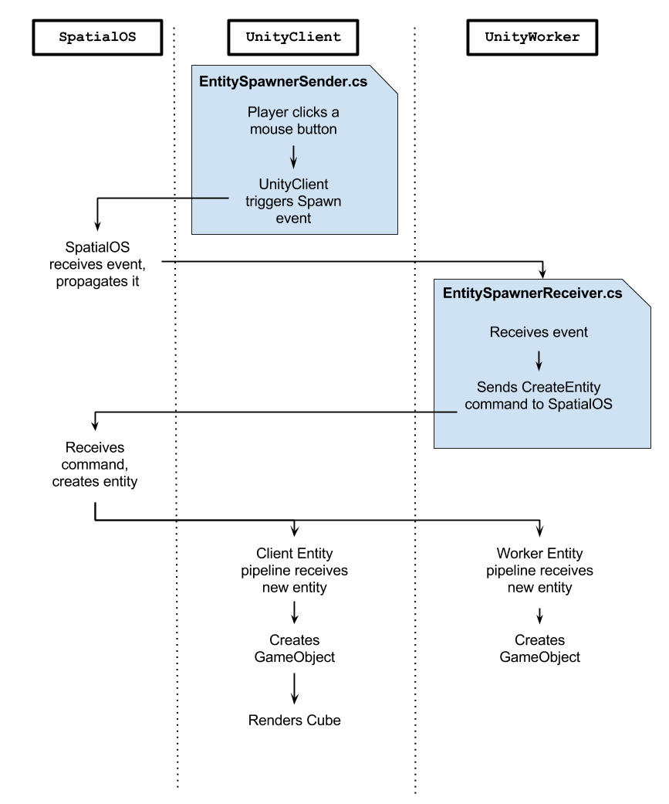
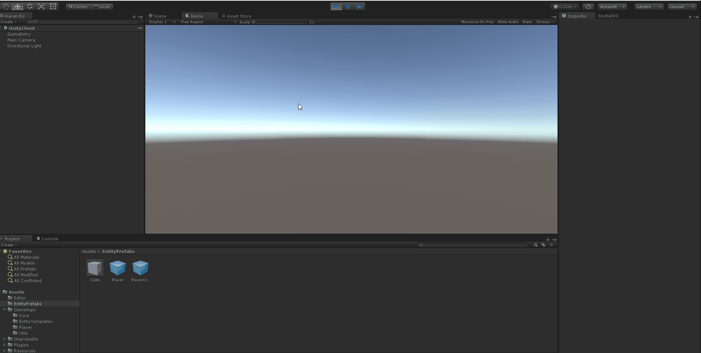
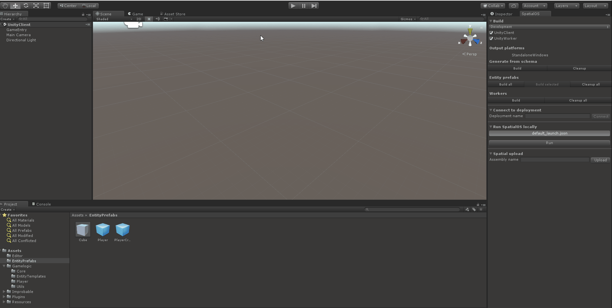
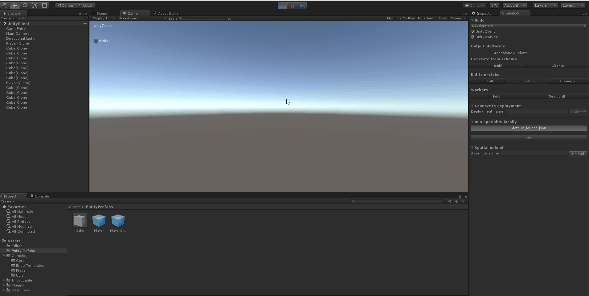

# Creating an entity at runtime with the Unity SDK

This recipe shows how to create entities in a SpatialOS game using the SpatialOS Unity SDK.

Your game world will contain entities which were defined in a snapshot, but your
game will likely need to spawn further entities at run-time. This might occur if:

* A new enemy needs to be spawned for players to fight.
* Items dropped on the ground are represented by entities.
* A new client connects to the game and a character entity needs to be spawned for
the player to control.

In this recipe you will be creating simple cube entities on your server-side UnityWorkers,
based on player-input to the UnityClient worker. Each time a player presses their
mouse button, a new cube entity will appear for all connected clients.

You can use the [Unity Starter Project](https://github.com/spatialos/StarterProject/tree/master) as the starting point of this recipe,
or use the ideas and code snippets in a project of your own.

## Design considerations

The most important decision is which worker should perform the spawning of the cubes.

Creating entities requires appropriate [worker permissions (SpatialOS documentation)](https://docs.improbable.io/reference/13.0/shared/worker-configuration/permissions)
(usually defined in `default_launch.json`), which UnityWorkers are granted by default. To
achieve your goal you *could* grant UnityClients permission to create entities, but
if clients are malicious they could use this to create entities in an uncontrollable
way. It's therefore generally preferable to send your player's requests for entity
creation to the server-side workers which can fulfill the request if they consider
it appropriate.

To implement this you will:

- Add a `Spawn` **component event** to a new `CubeSpawner` component which will handle the Player's new ability.
- Add a client-side script to trigger the `Spawn` event based on player input.
- Add a server-side callback for when the `Spawn` event occurs.

Here's what you will be building in the form of a sequence diagram:



The light-blue boxes are the scripts which you will create. The rest is already handled by SpatialOS.

## 1. Define the `CubeSpawner` component

Create a new file called `CubeSpawner.schema` in the `schema/improbable/player` directory.

In this component you will define a single component event, `spawn`. Component events define
a package or payload of data to be synchronised with the event. You will define this
payload as a new type, `SpawnData`, which will contain a single coordinate position
- the location at which the cube should be spawned.

The contents of your `CubeSpawner.schema` should look something like this:

```
package improbable.player;

import "improbable/standard_library.schema";

type SpawnData {
  Coordinates initial_position = 1;
}

component CubeSpawner {
  id = 1004;
  event SpawnData spawn;
}
```

After creating `CubeSpawner.schema`, don't forget to generate the code either
through Unity `SpatialOS window > Build > Generate from schema > Build` or by
running `spatial worker codegen`.

## 2. Add `CubeSpawner` to the `Player` entity

In the C# files of your Unity project, navigate to where your `Player` entity's components are defined.

In the Starter Project, this is in `Assets/Gamelogic/EntityTemplates/EntityTemplateFactory.cs`,
in a function called `CreatePlayerTemplate`, and uses the `EntityBuilder` syntax to
include components in the entity template and set their write-access permissions.

Add the following line before the call to `.Build()`:

```cs
.AddComponent(new CubeSpawner.Data(), CommonRequirementSets.SpecificClientOnly(clientId))
```

Normally write-access for a component is configured for a *type* of worker, but in
this case it is tied to a `WorkerId` (using the convenient `SpecificClientOnly` function).
This guarantees that only one specific client can ever have write-access to the entity's
`CubeSpawner` component: the client belonging to the player which 'owns' that `Player`
entity.

## 3. Raise the `Spawn` event

Next you will add a client-side script to the `Player` which will respond to mouse
clicks by triggering the `Player` entity's `spawn` event.

On the `Player` prefab create a new script `CubeSpawnerSender` with the following contents:

```cs
using Improbable.Player;
using Improbable.Unity;
using Improbable.Unity.Common.Core.Math;
using Improbable.Unity.Visualizer;
using UnityEngine;

namespace Assets.Gamelogic.Player
{
    [WorkerType(WorkerPlatform.UnityClient)]
    public class CubeSpawnerSender : MonoBehaviour
    {
        [Require] private CubeSpawner.Writer CubeSpawnerWriter;

        private void Update()
        {
            if (Input.GetMouseButtonUp(0)) {
              var spawnPosition = new Vector3(0, 3, 0);

              CubeSpawnerWriter.Send(new CubeSpawner.Update()
                  .AddSpawn(new Spawn(spawnPosition.ToSpatialCoordinates())));
            }
        }
    }
}
```

The WorkerType is specified as `WorkerPlatform.UnityClient` so this script will only
be present on client-side representations of the `Player` prefab (it will be off
of the server-side `Player` prefab asset during the prefab exporting process.)

The `[Require]` syntax specifies a `CubeSpawner.Writer`, so this script will only
be enabled on the one worker which has write-access to the entity's `CubeSpawner`
component.

On each `Update()` call, a mouse button-up prompts the UnityClient worker to send
a `Spawn` event (by adding it to a component update). SpatialOS will then synchronize
this event across all interested workers (which have the `Player` entity checked
out into their view) will be notified by SpatialOS of the `Player` entity's event.

The "interested workers" in this case may be other UnityClient workers (other players)
as well as UnityWorker workers. In the next section you will attach a server-side callback to
that event so that and event triggered by the UnityClient worker is responded to
by the UnityWorker.

## 4. Handle the event by creating a cube entity

> In our scenario, the `Player` entity is both the cause of the creation and the creator
of the `Cube`. The cause is a client-side event and the creation is a server-side event,
but in both cases the logic being executed is associated with (or on behalf of)
the `Player` entity.

> SpatialOS events are very effective for this type of communication
between representations of the same entity but on different workers.
In other scenarios, where communication between entities is desired, using a **command**
instead of an **event** might be a better decision. 

> For a more thorough discussion, see
[Component best practices (SpatialOS documentation)](https://docs.improbable.io/reference/13.0/shared/design/component-best-practices).

You'll now add a server-side script to the `Player` which will attach a callback
to updates of the `CubeSpawner` component, which will use the entity creation API
to create a new cube entity in response.

Again on the `Player` prefab create another new script `CubeSpawnerReceiver`:

```cs
using Assets.Gamelogic.EntityTemplates;
using Improbable;
using Improbable.Player;
using Improbable.Unity;
using Improbable.Unity.Core;
using Improbable.Unity.Visualizer;
using UnityEngine;

namespace Assets.Gamelogic.Player
{
    [WorkerType(WorkerPlatform.UnityWorker)]
    public class CubeSpawnerReceiver : MonoBehaviour
    {
        [Require] private Position.Writer PositionWriter;
        [Require] private CubeSpawner.Reader CubeSpawnerReader;

        private void OnEnable()
        {
            CubeSpawnerReader.SpawnTriggered.Add(CreateCube);
        }

        private void OnDisable()
        {
            CubeSpawnerReader.SpawnTriggered.Remove(CreateCube);
        }

        private void CreateCube(Spawn args)
        {
            var cubeTemplate = EntityTemplateFactory.CreateCubeTemplate(args.initialPosition);
            SpatialOS.Commands.CreateEntity(PositionWriter, cubeTemplate);
        }
    }
}
```

SpatialOS component events (such as the `spawn` event you created) can be received
by **multiple** workers, so the `[Require]` syntax is used to require a `Position.Writer`,
which only one UnityWorker will ever have. This lets us guarantee that only one
Unity worker will execute this code and attempt to create a cube entity in response
to the event.

The `SpawnTriggered` Unity event which is accessible through the **Reader** was automatically
created from the `spawn` component event during **codegen**, and this script adds a
callback function so that this worker executes some logic in response to the event.

The SpatialOS API includes **worker commands**, which can be performed by a worker independently
from any entities or components. In this situation we are using the `CreateEntity`
worker command. If the worker is not configured to have entity creation permissions
then this command will fail. The above script is running on a `UnityWorker` which
by default _does_ have entity creation permissions, so as a result SpatialOS will
create a new `Cube` entity.

The `CreateEntity` function accepts an `Entity` object as a template for the new
entity it will create. The entity template describes the components an entity will
have, defines some initial values and sets its worker write-access permissions.

The new entity's initial position is determined by the value in the `Position` component
of its entity template. In this example the position is set using a value carried inside the
`spawn` event's `SpawnData` payload.

At this point your code won't compile since you are passing a parameter to `EntityTemplateFactory.CreateCubeTemplate`
but it doesn't take any. Navigate to `EntityTemplateFactory.cs` and adjust the parameters
of the `CreateCubeTemplate` method to look as follows:

```cs
public static Entity CreateCubeTemplate(Coordinates initialPosition = default(Coordinates))
{
    var cubeTemplate = EntityBuilder.Begin()
        .AddPositionComponent(initialPosition.ToUnityVector(), CommonRequirementSets.PhysicsOnly)
        .AddMetadataComponent(entityType: SimulationSettings.CubePrefabName)
        .SetPersistence(true)
        .SetReadAcl(CommonRequirementSets.PhysicsOrVisual)
        .AddComponent(new Rotation.Data(Quaternion.Identity), CommonRequirementSets.PhysicsOnly)
        .Build();

    return cubeTemplate;
}
```

With this in place you are ready to run the game and spawn some cubes. Head back to Unity and rebuild all entity
prefabs, build workers and regenerate the seed snapshot. Have a look at 
[What and when to build](../../develop/build.md) if you are new to the development workflow.

Press `Run` in the SpatialOS window under `Run SpatialOS locally` to start the game. After it loads, start the
`UnityClient` scene in your Unity editor to connect as normally. Once connected, clicking
the left mouse button should spawn a cube on top of the one which is there on start-up.
You should also be able to see the game object for the newly created cube entity
appear in the `Hierarchy` window in Unity as well as in the [Inspector (SpatialOS documentation)](https://docs.improbable.io/reference/13.0/shared/glossary#inspector) at
[http://localhost:21000/inspector](http://localhost:21000/inspector).



## 5. (Optional) Adding physics to the cubes

This step is intended to make the creation of the cubes a more visually obvious.
It is not required as part of the actual entity creation process.

If you spawn multiple cubes, you will notice they just appear in the same place. In order to make them physical, add a
`Rigidbody` component to the `Cube` entity prefab found in the `Assets/EntityPrefabs`
directory of your Unity project. After rebuilding the `Cube` entity prefab and restarting the game,
your cubes should be affected by gravity as well as collisions.



However, remember that their movement is not synchronized between workers through the `Position` component.
This means connecting to the game as another player all cubes will appear at the position they were initially spawned.
Combined with the `Rigidbody` behaviour this results in an interesting effect:



To take things further, you could create a `PositionSender` whose purpose is to update the `Position` component of
`Cube` entities in response to changes in position on the client. Building on this leads to topics such as [Client-Side
Prediction and Server reconciliation](http://www.gabrielgambetta.com/client-side-prediction-server-reconciliation.html)
and [Access control lists (SpatialOS documentation)](https://docs.improbable.io/reference/13.0/shared/design/understanding-access).

# Conclusion

In this recipe you have looked at code required to create new entities at run-time, using
the `CreateEntity` worker command and an entity template.

You made use of:

* Component events to send information from client-side to server-side.
* `[Require]` syntax with a component `Writer` to ensure only one server-side worker responds.
* The `CreateEntity` worker command to create a new entity using an entity template.

If you are interested in other entity management functions you can find information
on [deleting entities](../../interact-with-world/create-delete-entities.md#deleting-an-entity)
in the Unity SDK documentation.
