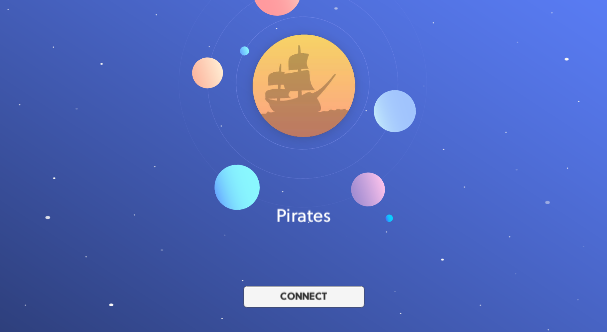
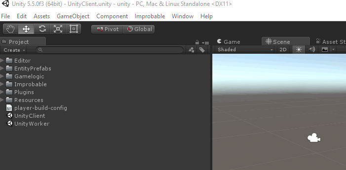
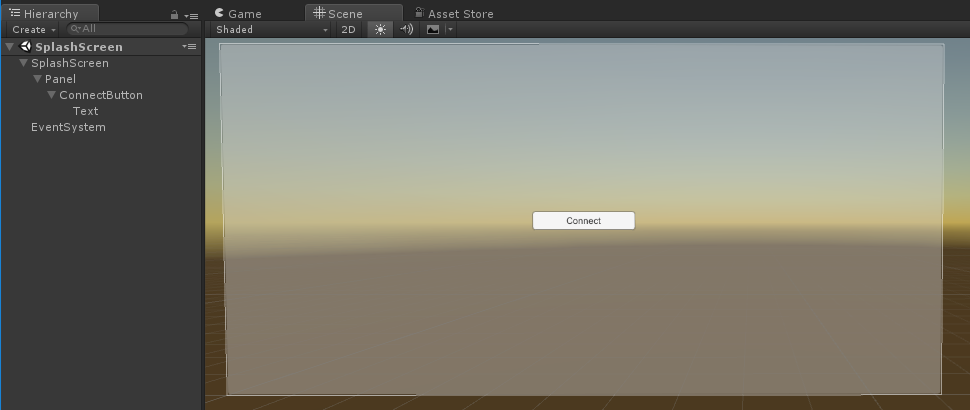
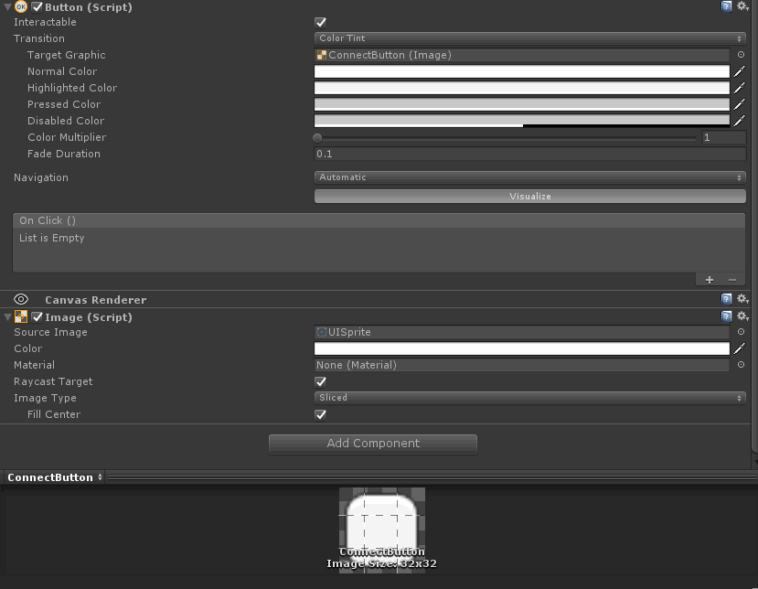
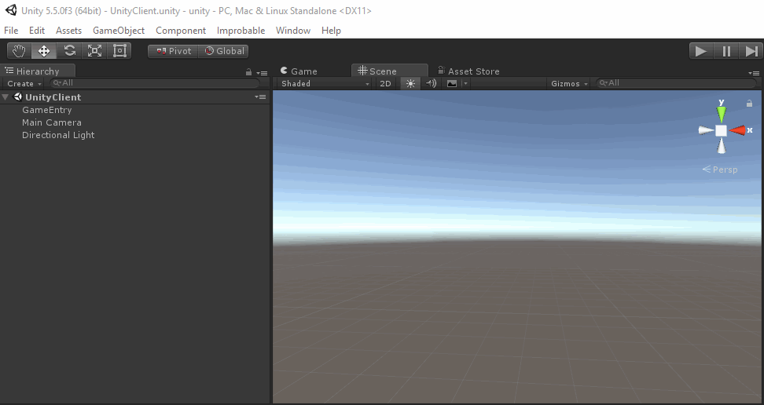

# Creating a connection splash screen in Unity

This recipe shows how to add a splash screen when a client connects to a Unity SDK project. If you're looking
for an introduction to using multiple scenes in a SpatialOS project, this is a good place to start.

You can use the [Starter Project](https://github.com/spatialos/StarterProject/tree/master) as the starting point for this recipe.

In this recipe, the splash screen has a button which the user clicks to attempt to connect to the game. If the connection
is unsucccessful (for example, if SpatialOS isn't ready for a client to connect), it fails. This implemenation is pretty
basic - you can extend it if you want more complex menu functionality.

Here's an example of what a splash screen might look like:



Creating a splash screen requires setting up your project to support multiple Unity scenes. This has already been done
in the Starter Project, but you can find out how it's done in the
[Loading from multiple scenes](../../customize/multiple-scenes.md) page.

## 1. Create the scene

1. Create the scene in the Unity `Assets` folder using the `Assets > Create > Scene` drop-down menu.

    Give it a new name - for example, `SplashScreen`.

    

2. Add the new scene name to `BuildSettings.cs` (in `Assets/Gamelogic/Core`).

    ```csharp
    public static readonly string UnityClientScene = "UnityClient";
    public static readonly string SplashScreenScene = "SplashScreen";
    ```

3. Add the new scene to the list of client scenes in `BuildSettings.cs`.

    ```csharp
    public static readonly string ClientDefaultActiveScene = UnityClientScene;
    public static readonly string[] ClientScenes = { UnityClientScene, SplashScreenScene };
    ```

## 2. Add the splash screen content

1. Open the new `SplashScreen` scene and delete all the `GameObjects` in it.

    Unity adds a camera and lighting to new scenes, but you'll load this scene [additively](https://docs.unity3d.com/ScriptReference/Application.LoadLevelAdditive.html), so it will already have
    loaded the lighting and camera.

2. Create a new `Panel` using the drop-down menu: `GameObject > UI > Panel`. This will also automatically
create a `Canvas` for you.

    Give the `Canvas` a new name - for example, `SplashScreen`.

3. Add a `Button` by selecting the `Panel` and using the drop-down menu: `GameObject > UI > Button`.

    Give it a new name - for example, `ConnectButton`.

This is how it should look:



The Unity `Button` component provides an easy way to assign a callback for button presses, so you'll add
a callback that tries to connect to the game.

## 3. Modify the Bootstrap script

You need to edit `Bootstrap.cs` to provide a method that starts the connection to the game. This will be used by
the `Connect` button callback later.

1. In `Bootstrap.cs`, add the following `ConnectToClient()` method for the splash screen to call:

    ```csharp
    public void ConnectToClient()
    {
        SpatialOS.Connect(gameObject);
    }
    ```

2. Move the line `SpatialOS.Connect(...)` to the location in the snippet below. This is because you only want it
to be called by UnityWorkers; UnityClients will connect using the splash screen.

    ```csharp
    public void Start()
    {
        ...
        switch (SpatialOS.Configuration.WorkerPlatform)
        {
            case WorkerPlatform.UnityWorker:
                Application.targetFrameRate = SimulationSettings.TargetServerFramerate;
                SpatialOS.OnDisconnected += reason => Application.Quit();
                SpatialOS.Connect(gameObject); // Move the line here
                break;
            case WorkerPlatform.UnityClient:
                Application.targetFrameRate = SimulationSettings.TargetClientFramerate;
                SpatialOS.OnConnected += CreatePlayer;
                break;
        }

        // This is where you needed to move the line `SpatialOS.Connect(...)` from
    }
    ```

3. At the top of the script, add the following import:

    ```csharp
    using UnityEngine.SceneManagement;
    ```

4. Inside UnityClient's `case`, add a line to load the `SplashScreen` scene . Use `Additive` mode since you want to load this
scene on top of a currently loaded one:

    ```csharp
    SceneManager.LoadSceneAsync(BuildSettings.SplashScreenScene, LoadSceneMode.Additive);
    ```

The `Start()` method should look like this:

```csharp
using UnityEngine.SceneManagement;

...

public void Start()
{
    ...
    switch (SpatialOS.Configuration.WorkerPlatform)
    {
        case WorkerPlatform.UnityWorker:
            Application.targetFrameRate = SimulationSettings.TargetServerFramerate;
            SpatialOS.OnDisconnected += reason => Application.Quit();
            SpatialOS.Connect(gameObject);
            break;
        case WorkerPlatform.UnityClient:
            Application.targetFrameRate = SimulationSettings.TargetClientFramerate;
            SpatialOS.OnConnected += CreatePlayer;
            SceneManager.LoadSceneAsync(BuildSettings.SplashScreenScene, LoadSceneMode.Additive);
            break;
    }
}

public void ConnectToClient()
{
    SpatialOS.Connect(gameObject);
}
```

## 4. Handle the button press

1. Create a script called `SplashScreenController.cs` on the `SplashScreen` Unity canvas, which receives the button
press event, and calls the `AttemptConnection()` method:

    ```csharp
    using Assets.Gamelogic.Global;
    using Assets.Gamelogic.Utils;
    using Improbable.Unity.Core;
    using UnityEngine.UI;

    public class SplashScreenController : MonoBehaviour
    {
        [SerializeField]
        private Button ConnectButton;

        public void AttemptSpatialOsConnection()
        {
            DisableConnectionButton();
            AttemptConnection();
        }

        private void DisableConnectionButton()
        {
            ConnectButton.interactable = false;
        }

        private void AttemptConnection()
        {
            FindObjectOfType<Bootstrap>().ConnectToClient();
            StartCoroutine(TimerUtils.WaitAndPerform(SimulationSettings.ClientConnectionTimeoutSecs, ConnectionTimeout));
        }

        private void ConnectionTimeout()
        {
            if (SpatialOS.IsConnected)
            {
                SpatialOS.Disconnect();
            }

            ConnectButton.interactable = true;
        }
    }
    ```

    In the script above:

    * Changing the button `interactable` property prevents the user sending multiple attempts to connect at once.

    * Using a coroutine in `TimerUtils` and the `ClientConnectionTimeoutSecs` duration makes the user wait before trying
    to connect again (you'll set this value in the next step).

    * The `SpatialOS.Disconnect()` method call tidies up any Unity components created in the failed connection attempt.

2. In `SimulationSettings.cs`, add a new constant (you can set it to a different value):

    ```csharp
    public static readonly float ClientConnectionTimeoutSecs = 7;
    ```

3. Attach the `ConnectButton` to the `SplashScreenController.cs` script on the `SplashScreen` `GameObject` by dragging and dropping it into its `ConnectButton` field.

    

4. Connect the button clicks to the `AttemptSpatialOsConnection()` method by adding it to the button's `OnClick()` functions list:

    1. Beneath the `On Click ()` section, on the right, click the `+` button.

    2. Next to `None (object)` click the circle icon. In the drop-down that opens, select the `SplashScreen` scene.

    3. Click where it says `No function`. In the drop-down menu, select `SplashScreenController > AttemptSpatialOsConnection ()`.

        

## 5. Hide the splash screen

All that remains is to remove the splash screen once the player is connected, ie when the `Player` entity  has been
created.

To check for this:

1. Open a script on the `Player` where the connecting user's client has write access.

     In the Starter Project, you can use `SendClientConnection.cs`.

2. Add the following import statement:

    ```csharp
    using UnityEngine.SceneManagement;
    ```

3. In `OnEnable()`, include the following:

    ```csharp
    SceneManager.UnloadSceneAsync(BuildSettings.SplashScreenScene);
    ```

## 6. Test that it worked

0. Build workers: in the SpatialOS window (`Window > SpatialOS`),
under `Workers`, click `Build`.
2. Under `Run SpatialOS locally`, click `Run`.
3. Connect a UnityClient by opening the UnityClient scene, then pressing play `Play` in your Unity project.
4. You should see:

    * The `SplashScreen` being loaded when the Unity client is started.
    * When you press `Connect`, the connection to SpatialOS is made.
    * This causes the `Player` entity to be created, and the `SplashScreen` scene to be unloaded.

    That looks like this:

    


If you want to improve this basic implementation, you could:

* Display an error message if the connection is unsuccessful (as in the [Pirates](../../tutorials/pirates/overview.md) and
[Wizards](../../get-started/tour.md) projects).

* Use 3rd-party authentication: show username and password input fields on the splash screen that call 3rd-party
authentication before attempting to connect to SpatialOS.
