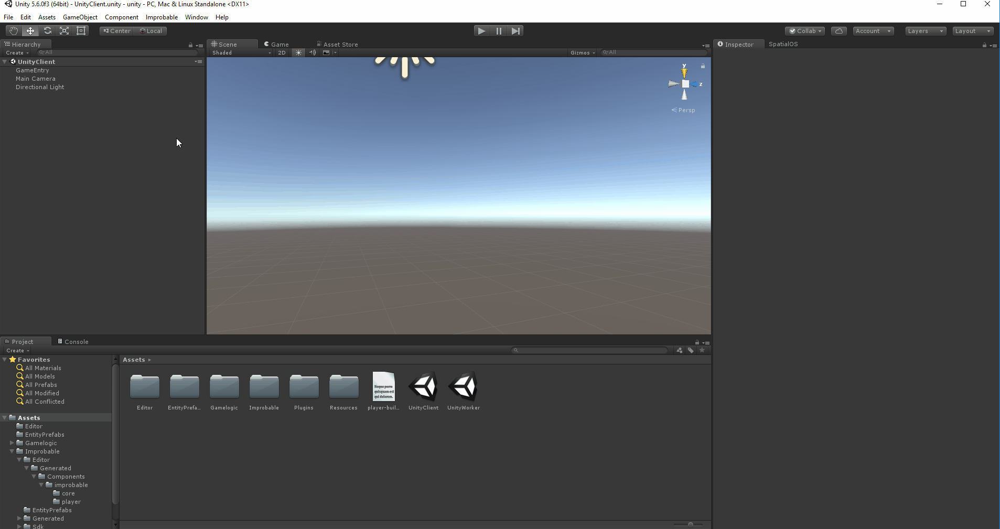
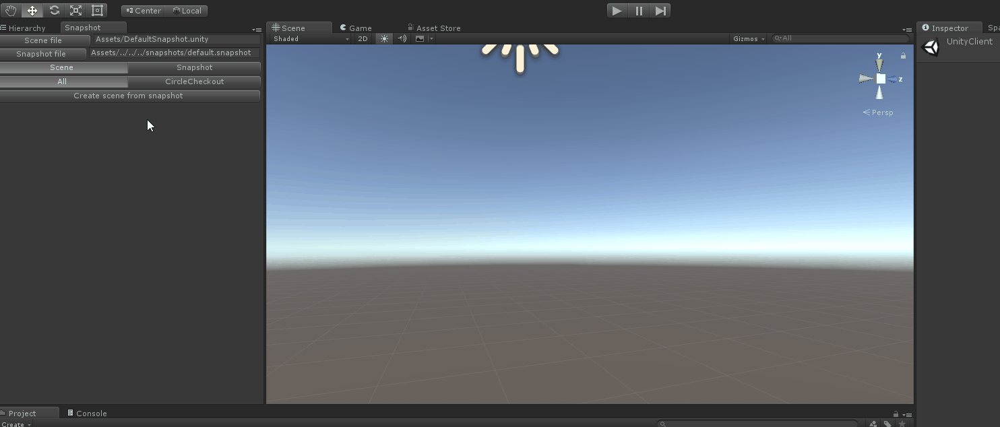

# Work with snapshots in the Unity Editor

This recipe gives you some tips about being more productive when manipulating [snapshots (SpatialOS documentation)](https://docs.improbable.io/reference/12.2/shared/glossary#snapshot).
The aim is to keep it simple and short and you will probably see many ways
to extend it and generalise certain steps. Hopefully, you will be able to connect the dots to achieve the ideal
workflow for your project. As always, if you have any questions, ask for advice on the [forums](https://forums.improbable.io).

A frequent use-case is creating a snapshot from a scene or populating a scene from a snapshot during local development.
The [Snapshots API (SpatialOS documentation)](https://docs.improbable.io/reference/12.2/csharpsdk/using#snapshots) is very simple but paired
with some Unity Editor scripts it can speed up the world design process.

> Have a look at
[**spatial project history snapshot** (SpatialOS documentation)](https://docs.improbable.io/reference/12.2/shared/spatial-cli/spatial-project-history-snapshot)
for the command-line tools to manage project snapshots.

You can use the [Unity Starter Project](https://github.com/spatialos/StarterProject) as the starting point of this recipe,
but it should work the same way for your own SpatialOS project.

## Outline

The aim of this recipe is to get you started using the Snapshot API. By the end you will have editor menus for loading
the default snapshot into a new scene in Unity and saving a Unity scene back to the snapshot after changes have been
made.



This is followed by some suggestions for extending it to match different workflows such as:

- A designer needs to apply final touches to the snapshot for a procedurally generated forest
- A developer needs to place procedurally generated content on top of a scene from Digitial Content Creators

## Scene to snapshot

You may be already familiar with the `SnapshotMenu.cs` editor script. Currently it provides a method which can be
called from the `Improbable/Snapshots/Generate Default Snapshot` menu to programmatically create a snapshot. This is
useful for simple static or procedurally-generated snapshots. However, you will probably want to use the Unity scene editor as a tool to create, modify and save snapshots, too. You will be able to drag and drop entity prefabs into a scene, move them around, and save that state to a snapshot.

In order to create a snapshot from a scene you need to make game objects which represent entities aware of that. You
might be familiar with the `EntityTemplateFactory` script which has some helper methods that you should now make
available as scripts on the entity prefabs they are responsible for creating. Another option would be keeping a map of
prefab names to the method for building the entity. You have to make a choice between maintaining this data structure
and the required lookups or adding a script to each of the entity prefabs you want saved in a snapshot. Depending
on the use case one or the other or a combination of both will feel better. In this recipe we will add a new script to
our entity prefabs.

Call it `EntityTemplate.cs` and save it under `Gamelogic/EntityTemplates`:

```cs
using Improbable.Core;
using Improbable.Unity.Common.Core.Math;
using Improbable.Unity.Core.Acls;
using Improbable.Unity.Entity;
using UnityEngine;
using Quaternion = UnityEngine.Quaternion;
#if UNITY_EDITOR
using UnityEditor;
#endif

namespace Assets.Gamelogic.EntityTemplates
{
    [ExecuteInEditMode]
    public class EntityTemplate : MonoBehaviour
    {
        public virtual IComponentAdder EntityBuilder()
        {
#if UNITY_EDITOR
            var prefab = PrefabUtility.GetPrefabParent(gameObject);
            var rotation = new Improbable.Core.Quaternion(transform.rotation.x, transform.rotation.y,
                transform.rotation.z, transform.rotation.w);

            return Improbable.Unity.Entity.EntityBuilder.Begin()
                .AddPositionComponent(transform.position, CommonRequirementSets.PhysicsOnly)
                .AddMetadataComponent(entityType: prefab.name)
                .SetPersistence(true)
                .SetReadAcl(CommonRequirementSets.PhysicsOrVisual)
                .AddComponent(new Rotation.Data(rotation), CommonRequirementSets.PhysicsOnly);
#else
            return null;
#endif
        }
    }
}
```

> Don't forget to add this script as a component to your prefabs which represent an
entity.

The `EntityBuilder` method finds the prefab linked to your game object and sets up the required components for the
entity. It will be called during a traversal of all objects in the scene which have an `EntityTemplate` component. Its
behaviour can be extended via sub-classing when adding custom components to entities of a given type:

```cs
public class PlayerCreatorEntityTemplate : EntityTemplate
{
    public override IComponentAdder EntityBuilder()
    {
        return base.EntityBuilder()
                   .AddComponent(new PlayerCreation.Data(), CommonRequirementSets.PhysicsOnly);
    }
}
```

Now you can add a new `MenuItem` method to `SnapshotMenu.cs` called `GenerateDefaultSnapshotFromScene`. It simply
filters all game objects with an `EntityTemplate` component and uses the `EntityBuilder` method on each. Then the
entities are passed to a dictionary with unique identifiers which is saved to the snapshot. The `SaveSnapshot` method
is included for reference only, it already exists in `SnapshotMenu.cs`:

```cs
[MenuItem("Improbable/Snapshots/Generate Default Snapshot from Scene")]
private static void GenerateDefaultSnapshotFromScene()
{
    var entities = FindObjectsOfType<EntityTemplate>()
        .Select(t => t.gameObject.GetComponent<EntityTemplate>().EntityBuilder().Build());

    var currentEntityId = 1;
    SaveSnapshot(entities.ToDictionary(e => new EntityId(currentEntityId++)));
}

private static void SaveSnapshot(IDictionary<EntityId, Entity> snapshotEntities)
{
    File.Delete(SimulationSettings.DefaultSnapshotPath);
    var maybeError = Snapshot.Save(SimulationSettings.DefaultSnapshotPath, snapshotEntities);

    if (maybeError.HasValue)
    {
        Debug.LogErrorFormat("Failed to generated world snapshot: {0}", maybeError.Value);
    }
    else
    {
        Debug.LogFormat("Successfully generated world snapshot at {0}", SimulationSettings.DefaultSnapshotPath);
    }
}
```

## Snapshot to scene

It is often convenient for a designer to visualise and tweak procedurally-generated snapshots to add the finishing
touch. What's more, you might want to exclude such scenes from source control and have the ability to re-generate them
from the saved snapshots. This section shows you how to close the load-modify-save loop for snapshots in scenes.

You already saw how to implement the modify and save steps in the previous section. The first step in this process is
loading a snapshot into a scene. Note that this is different from the `UnityClient` scene with a connected player,
because in large worlds game objects will be created only for the entities close to where the player is. A snapshot is
not restricted by this - it contains information about all entities in the world.

In `SnapshotMenu.cs` add a new method for a `MenuItem`:

```cs
[MenuItem("Improbable/Snapshots/Scene from Default Snapshot")]
private static void CreateSceneFromDefaultSnapshot()
{
    // Load default snapshot
    IDictionary<EntityId, Entity> snapshot;
    if (!TryLoadSnapshot(out snapshot))
    {
        return;
    }

    // Create and open a new scene
    var scene = EditorSceneManager.NewScene(NewSceneSetup.EmptyScene, NewSceneMode.Single);

    // Add a prefab for each entity
    PopulateSceneFromSnapshot(snapshot);

    // Save populated scene
    EditorSceneManager.MarkSceneDirty(scene);
    EditorSceneManager.SaveOpenScenes();
}
```

This is a high-level view of the solution which could be broken down into 4 helper methods:

- `TryLoadSnapshot` - Loads the right snapshot from a file, performs error handling
- `OpenNewScene` - Configures the scene to use for instantiating game objects
- `PopulateSceneFromSnapshot` - Creates game objects based on the snapshot
- `SavePopulatedScene` - Makes sure the newly created objects aren't lost

For brevity the snippet contains the actual code instead of `OpenNewScene` and `SavePopulatedScene`. In different use-cases 
you will probably find it useful to modify or extend one or many of these helpers. For example, you might choose
to:

- Select a snapshot file to load from the editor
- Have a mapping between snapshot files and generated scene names
- Populate the scene only with a certain type of entity instead of using the whole snapshot
- Save the scene state on top of an exisitng snapshot instead of creating a new one from scratch

`TryLoadSnapshot` uses the Snapshot API to load a dictionary of all entities in memory:

```cs
private static bool TryLoadSnapshot(out IDictionary<EntityId, Entity> snapshot)
{
    var errorOpt = Snapshot.Load(SimulationSettings.DefaultSnapshotPath, out snapshot);
    if (errorOpt.HasValue)
    {
        Debug.LogErrorFormat("Error loading snapshot: {0}", errorOpt.Value);
    }
    return !errorOpt.HasValue;
}
```

`PopulateSceneFromSnapshot` is the main logic for instantiating a game object in the scene for each entity:

```cs
private static void PopulateSceneFromSnapshot(IDictionary<EntityId, Entity> snapshot)
{
    foreach (var pair in snapshot)
    {
        var entity = pair.Value;
        if (entity.Get<Metadata>().HasValue)
        {
            var prefabName = entity.Get<Metadata>().Value.Get().Value.entityType;
            var prefab = AssetDatabase.LoadAssetAtPath<GameObject>("Assets/EntityPrefabs/" + prefabName + ".prefab");

            var gameObject = PrefabUtility.InstantiatePrefab(prefab) as GameObject;

            var position = entity.Get<Position>().Value.Get().Value.coords.ToUnityVector();
            gameObject.transform.position = position;
        }
    }
}
```

There are several things to note and suggestions to consider:

- The use of `PrefabUtility.InstantiatePrefab` makes sure the link between the prefab and game object is kept. This
  will be useful later when we need to save the scene back to a snapshot.
- If other initial state is held in custom components for some entities (such as the current state of a state machine
  which determines what mesh to render), you might want to initialise this here.
- In certain cases there won't be a one-to-one relationship between entities and prefabs. You will need to determine
  how the `entityType` of the required `Metadata` component maps to what objects need to be created in your specific
  case.
- You might want to associate the `EntityId` with the game object you are creating in advanced snapshot editing
  scenarios to help saving back to a snapshot.

## Next steps

With this in place you have the basis for working with snapshots in Unity. You are highly encouraged to go ahead and
extend this basis to match your workflow better. Building out an editor window which fully exposes the configuration
that was left out as hard-coded strings in this recipe could be a good starting point. Here's an example which supports
checking out a small area of the snapshot to edit and saving it back while keeping the rest of the world unchanged.



If you're inspired by this, you could look into:

- Chunking large snapshots into multiple files which are loaded by the editor based on the are a designer is looking at
  to improve performance.
- Slicing snapshots into layers based on components or entity types to allow designers to pre-apply filters on what
  they want to load again for better performance and faster iteration.
- [Generating component serializers and deserializers from `schema` (SpatialOS documentation)](https://docs.improbable.io/reference/12.2/shared/schema/custom-codegen) to replace the
  `EntityBuilder` shown in this recipe with scripts which come for free every time you define a new component.

Many designers use Digital Content Creators (DCC) in their workflow and will prefer to edit there instead of in Unity.
Have a look at [this topic on our forums](https://forums.improbable.io/t/environment-creation/2496/4) for an example
which integrates with Maya and has a discussion about *world tiles* and mixing procedural techniques with designer
work.

[Snapshotting from the Local & Cloud Inspector](https://forums.improbable.io/t/snapshotting-from-the-local-cloud-inspector/2552) is also useful when you want to take a snapshot at run-time.

