> Building Unity iOS workers is experimental.

# Building for iOS targets in Unity
 
This page describes the required steps for a SpatialOS Unity project to build for iOS build targets. It assumes that you have an existing SpatialOS project, which you are intending to add iOS support using Unity.

While following this guide, you will adjust some of the SpatialOS scripts and Unity settings to prepare everything for iOS. This is needed to ensure that the Xcode project contains the necessary code to run your iOS worker successfully. The resulting Xcode project suffers from cyclic dependencies due to a bug in Unity and we provide you with a script to fix this.

At the end of the guide, you will be able to run and connect your iOS worker to a running deployment.

## Preparation

This guide assumes that you have an existing SpatialOS project, which you are intending to add iOS support using Unity.

First, determine if you have automatically generated build scripts for Unity turned on:

1. Locate the `workers/unity` folder of your SpatialOS project.
1. Open `spatialos.UnityClient.worker.json` in a text editor.
1. Open `spatialos.UnityWorker.worker.json` in a text editor.
1. If **either** of the above files have the line
   `"generated_build_scripts_type" : "unity"`,
   automatically generated build scripts are turned on.

Next, check if the following three files already exist in the `workers/unity` folder of your SpatialOS project:

* `spatialos.unity.client.build.json`
* `spatialos.unity.worker.build.json`
* `spatialos_worker_packages.json`

Do you see all three of those files?

* **I see all three of those files**:
  * Remove the line
  `"generated_build_scripts_type" : "unity"`
  from BOTH of the build scripts
  (`spatialos.UnityClient.worker.json` and `spatialos.UnityWorker.worker.json`)
  as described above.
  This will prevent them from being over-written each time you build.

* **I don't see any of those files**:
  1. Run `spatial worker build` once
  1. The files should now be generated.
  1. Remove the line `"generated_build_scripts_type" : "unity"`
     from BOTH of the build scripts
     i.e. `spatialos.UnityClient.worker.json` and `spatialos.UnityWorker.worker.json` as described above.
  This will prevent them from being over-written each time you build.

## 1. Modify your worker packages

Add an additional worker package to your Unity worker's worker packages JSON file:

1. Locate the `workers/unity` folder of your SpatialOS project.
1. Open `spatialos_worker_packages.json` in a text editor.
1. By default, you would have several `targets` specified, each with a `path`, `type`, and a list of `packages`.
1. Inside the `targets` array, add the following:

    ```json
    {
        "path": "Assets/Plugins/Improbable/CoreSDK/core-dynamic-arm-ios",
        "type": "worker_sdk",
        "packages": [
            {
                "name": "core-dynamic-arm-ios"
            }
        ]
    },
    {
        "path": "Assets/Plugins/Improbable/CoreSDK/core-dynamic-x86_64-ios",
        "type": "worker_sdk",
        "packages": [
            {
                "name": "core-dynamic-x86_64-ios"
            }
        ]
    }
    ```

## 2. Build Unity workers

1. Run `spatial codegen`.
1. To be able to run a cloud deployment, run `spatial worker build`. You will need to extract the login token from that deployment before building the iOS worker. To extract the login token, you need to do the following:
    * Go to your cloud deployment console overview page
    * Click on the `Launch` button
    * Right click on "Launch your deployment" and choose "Copy Link Address"
    * Copy the string that appears after `token=` in the copied link address. This is your login token.

## 3. Add/modify the linker configuration

As Unity automatically strips out code and assemblies for iOS workers, it is important to add a linker configuration
`link.xml`: it prevents some code from being stripped out by Unity.

> For more information about iOS Worker optimizations and how to customize the linker
configuration, see the [Unity Documentation](https://docs.unity3d.com/Manual/iphone-playerSizeOptimization.html).

Download [this file](../assets/unity-ios/link.xml) and put it into the `workers/unity/Assets` folder. If you are already using a `link.xml`, add the following lines to it:

```xml
<assembly fullname="Generated.Code" preserve="all"/>
<assembly fullname="Improbable.WorkerSdkCsharp" preserve="all"/>
```

## 4. Modify the `Bootstrap.cs` game object

1. in Unity, open the `ClientScene` or `UnityClient` scene found in the Assets folder of the project navigator.

    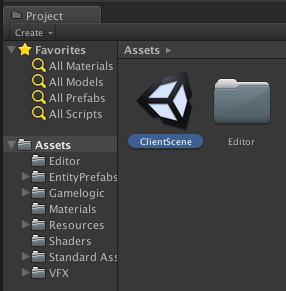
1. Click on the `GameEntry` game object in the scene hierarchy.
1. Open the `Bootstrap.cs` MonoBehaviour script by double clicking on the script in the Inspector.
1. By default, you will see the line:
    ```csharp
    SpatialOS.ApplyConfiguration(Configuration);
    ```

    Delete and replace any occurrence of it with the following code snippet:

    ```csharp
    List<string> commandLineArguments = null;
    #if UNITY_IOS
        // Set to the name of your SpatialOS project here.
        // This should match the project name as specified in spatialos.json
        const string APP_NAME = "<insert_your_project_name_here>";

        commandLineArguments = new List<string>(System.Environment.GetCommandLineArgs());
        commandLineArguments.AddRange(new List<string>()
        {
            "+" + CommandLineConfigNames.AppName, APP_NAME
        });

    #endif
    SpatialOS.ApplyConfiguration(Configuration, commandLineArguments);
    ```
1. **IMPORTANT:** Make sure to set the `APP_NAME` constant to your project name. This should match the project name as specified in `spatialos.json`.

1. In the `Bootstrap (Script)` panel of the Inspector:
    1. Click to expand `Configuration` -> `Debugging`.
        + For `Infra Service URL`:
            * If testing __locally__ (`spatial local launch`), set to:

                `http://127.0.0.1:21000`
            * If testing against a __deployment__ (`spatial cloud launch`), set to:

                `https://api.spatial.improbable.io`
    1. Click to expand `Configuration` -> `SpatialOS Application`.
        + For `Assembly Name`:
            * If testing __locally__ (`spatial local launch`), set to: `local_assembly`
            * If testing against a __deployment__ , leave it blank.
        + For `Login Token`:
            * If testing __locally__ (`spatial local launch`), leave it blank.
            * If testing against a __deployment__, set it to a valid login token.

        > These settings need to be applied whenever you switch between using cloud and local deployments.

    1. This image highlights the key settings required on your Bootstrap game object:

        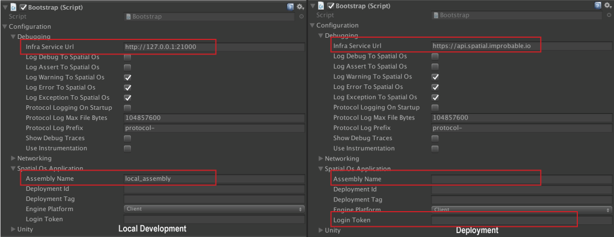

## 5. Update the iOS build settings

The following build settings are recommended for compatibility with SpatialOS.

1. Within Unity, access the build settings via: `File` -> `Build Settings...`

    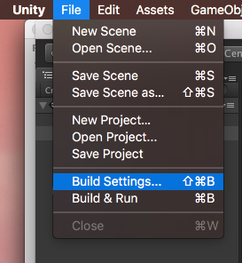
1. Under `Platform`, select `iOS` such that it is highlighted.

    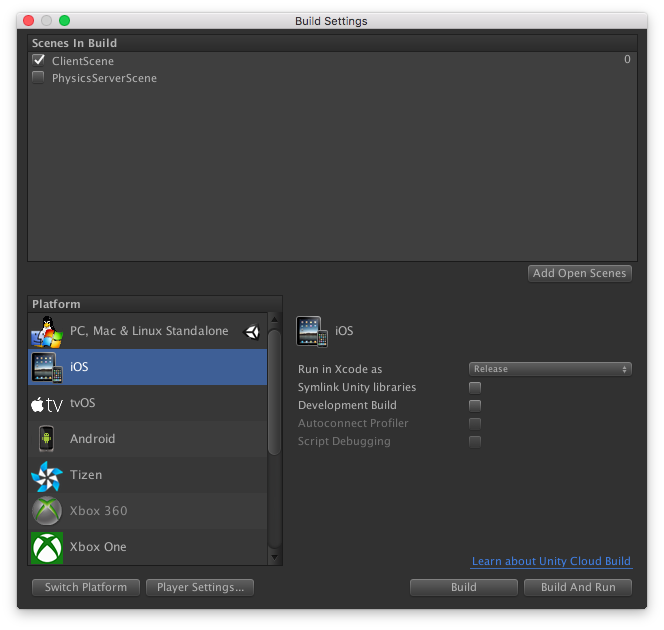
1. Click on `Player Settings...`. This should show the `Player Settings` in the Inspector.
    * Click the icon to make sure that you are in the `Settings for iOS` tab:

        
    * Expand the `Other Settings` section:

        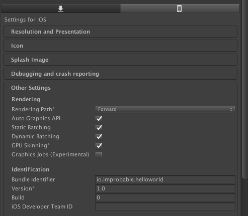

1. Configure `Other Settings` with the following settings:
    + Configuration:
         * Scripting Backend: `IL2CPP`
         * API Compatibility Level: `.NET 2.0`  
         * Target SDK: `Device SDK` or `Simulator SDK`
         * Target minimum iOS Version: `10.2` or higher
         * Allow downloads over HTTP (nonsecure): Checked
         * Architecture: `Universal` (Device) or `x86_64` (Simulator)
         * Scripting Define Symbols: `CROSS_PLATFORM_INPUT;MOBILE_INPUT`
    + Optimization
         * Strip Engine Code: __Un__ checked
         * Script Call Optimization: `Slow and safe`
    + When you're finished, your settings should look like this:

        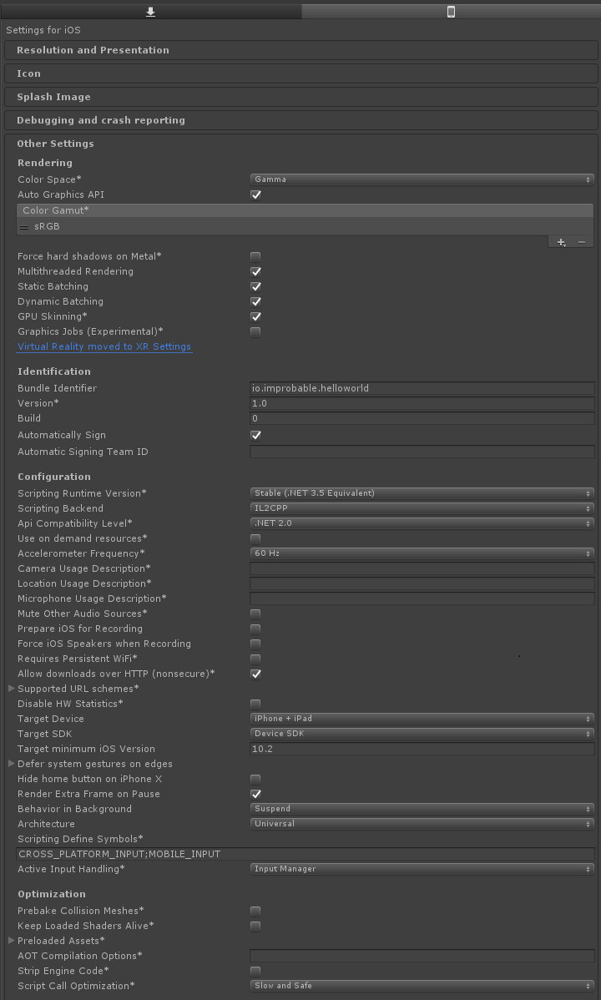

## 6. Update build targets

Open `workers/unity/Assets/player-build-config.json` and update the targets for the UnityClient. It should look like this:

    "UnityClient": {
      "Targets": [
        "iOS"
      ],
      "Assets": "Streaming"
    }

You can add additional build targets, if you want to build your client on multiple platforms.

## 7. Fix the CoreSdkDll imports

When building for iOS you need to change the plugin settings for the Windows CoreSdkDll plugin packages, to avoid a name collision when building the client.

1. In Unity, open `Assets/Plugins/Core/Windows/Plugins/x86` and select the `CoreSdkDll.dll` plugin.
1. Change the settings in the Unity inspector so that the plugin will not be included for the iOS platform. This should look as followed:

    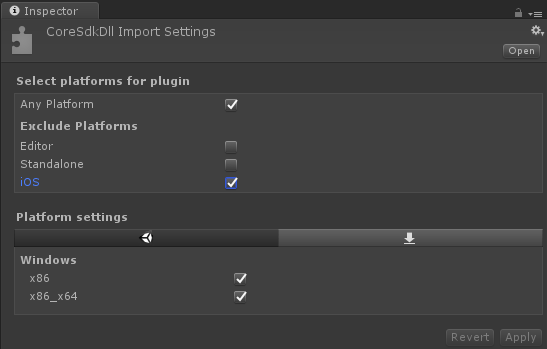
1. Repeat step 1 and 2 for the `x86_64` version of the plugin in `Assets/Plugins/Core/Windows/Plugins/x86_64`.

## 8. Build the iOS worker

Now you can use Unity to generate the Xcode project.

To do this:

* Use the `Improbable->Build->Build development/deployment workers` menu in Unity, or,
* Run `spatial worker build UnityClient`.

This will create a Xcode project in `workers/unity/build/worker/UnityClient@iOS/UnityClient@iOS/`

## 9. Update Xcode build settings

Once Unity has completed building the iOS worker, you will need to use Xcode to build and run the application on your iOS device or simulator.
There are several settings to configure in the generated Xcode project.

### 9.1. Modify the Xcode project settings

1. Open the Xcode project located in: `workers/unity/build/worker/UnityClient@iOS/UnityClient@iOS/Unity-iPhone.xcodeproj`
1. In the `Project Navigator` located on the left panel of Xcode, click on `Unity-iPhone`:

    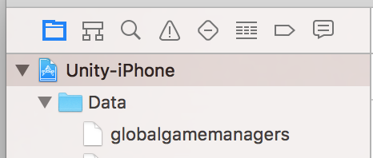
1. On the main pane of Xcode, click on Unity-iPhone listed under `Targets`(**not** `Project`!)

    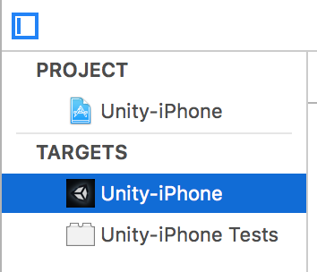
1. Click on the `Build Settings` tab.

    Make sure that both `All` and `Combined` tab settings are active.
    Then, make the following changes:

    

    * Architectures
        - `Architectures`: `x86_64` (Simulator) OR `armv7,armv7s,arm64` (Device).
        - `Base SDK`: Change to `Latest iOS` from the dropdown menu (e.g., `Latest iOS (iOS 10.2)`).
        - `Valid Architectures`: `x86_64` (Simulator) OR `armv7,armv7s,arm64` (Device).
    * Linking
        - `Runpath Search Paths`: Add `@executable_path`.
    * Search Paths
        - `Library Search Paths`: Remove all double quotes from the entries listed there.
            e.g., ``$(SRCROOT)/Libraries`` should be just `$(SRCROOT)/Libraries`
    * ENABLE_BITCODE
        - Set to `NO`

> **Hint:** Use the search bar to help find these settings.
>
> 

### 9.2. Add `libCoreSdkDll.dylib` to the project

1. Locate the appropriate platform version of the `libCoreSdkDll.dylib` in your project.
    * For iOS Simulators, locate it in `workers/unity/Assets/Plugins/Improbable/CoreSDK/core-dynamic-x86_64-ios/`.
    * For iOS Devices, locate it in `workers/unity/Assets/Plugins/Improbable/CoreSDK/core-dynamic-arm-ios/`.

1. Copy the selected `libCoreSdkDll.dylib` into the folder: `unity/build/worker/UnityClient@iOS/UnityClient@iOS/Data`.

    You can do this also by drag-and-dropping the file into the `Data` folder in the Xcode project navigator.
    The image below shows how your project and file system should look:

    

## 10. Codesign `libCoreSdkDll.dylib`

1. Inside your Xcode project, go to the Build Phases Tab and add `libCoreSdkDll.dylib` to the `Copy Files` section as an Executable.

    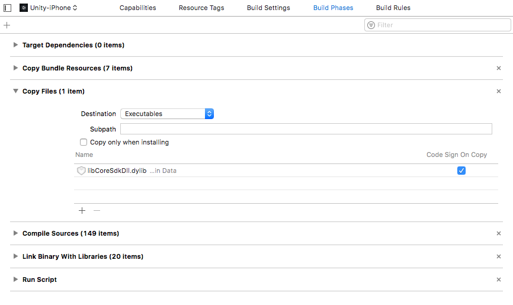

    If you don't see a `Copy Files` section, select your application target and go to `Editor->Add Build Phase->Add Copy Files Build Phase` in the Xcode menu.

1. Codesign the `libCoreSdkDll.dylib` in your project using your Apple Certificates. This can be done by running the following command in the terminal:

    ```bash
    codesign -s "iPhone Developer" <path_to_project>/workers/unity/build/worker/UnityClient@iOS/UnityClient@iOS/Data/libCoreSdkDll.dylib
    ```

## 11. Build and run Xcode project

1. In Xcode, start building your project using the `Product->Build` menu or by using `CMD+B`.
1. If you observe build errors related to `unknown type names`, this is due to a bug in Unity's IL2CPP code generation. We provide a script to fix these errors automatically:
    1. Ensure you have `pcregrep` installed to run the script successfully.
    1. Download [this script](../assets/unity-ios/fix_xcode_5_6.sh), if you use Unity 5.6.0.
    1. Download [this script](../assets/unity-ios/fix_xcode_2017.sh), if you use Unity 2017.3.
    1. Place the script into `workers/unity` and run it.

    1. You might see the following error when running the script: `"xcode-select: error: tool 'xcodebuild' requires Xcode, but active developer directory '/Library/Developer/CommandLineTools' is a command line tools instance"`.

        This can be fixed by running `xcode-select -s /Applications/Xcode.app/Contents/Developer`.

1. Run the project from Xcode by using the `Product->Run` menu, or using `CMD+R`, or pressing the play button.

    > **Note:** As with all client workers, make sure that your server is running,
    > either locally (`spatial local launch`) or from a deployment (`spatial cloud launch`).

If successful, Xcode will complete the build and begin running the application on your iOS device or iOS Simulator.

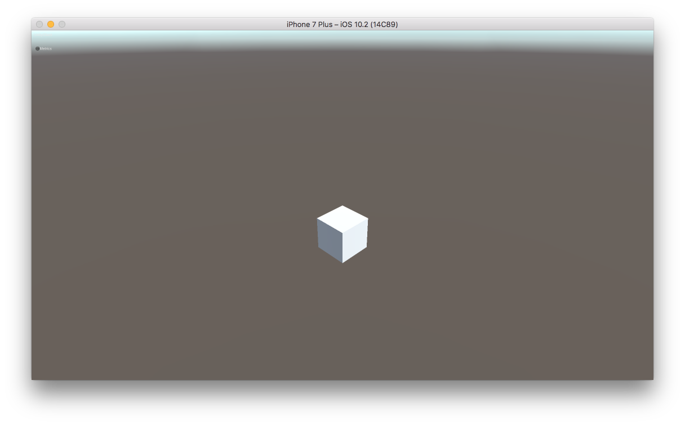
